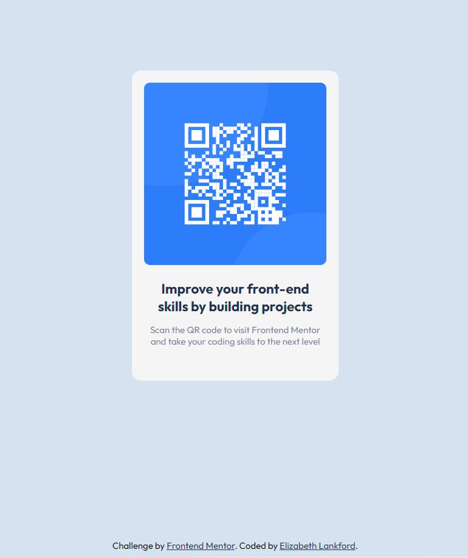

# Frontend Mentor - QR code component solution

This is a solution to the [QR code component challenge on Frontend Mentor](https://www.frontendmentor.io/challenges/qr-code-component-iux_sIO_H). Frontend Mentor challenges help you improve your coding skills by building realistic projects.

## Table of contents

- [Overview](#overview)
  - [Screenshot](#screenshot)
  - [Links](#links)
  - [Built with](#built-with)
  - [Useful resources](#useful-resources)
  - [Author](#author)

## Overview

Frontend mentor QR code component challange using HTML and CSS with responsive layout.

### Screenshot

### Links

- Solution URL: [Add solution URL here](https://your-solution-url.com)
- Live Site URL: [Add live site URL here](https://your-live-site-url.com)

### Built with

- Semantic HTML5 markup
- CSS custom properties
- Flexbox

### Useful resources

- [PX to EM conversion](https://www.w3schools.com/tags/ref_pxtoemconversion.asp) - This helped me with the px to em conversion. utilizing em makes responsive design easier when there is not much content.
- [Google Fonts](https://fonts.google.com/specimen/Outfit?query=outfi).

## Author

- Website - [Elizabeth Lankford](https://elizabeth-lankford.com/)
- Frontend Mentor - [@ElizabethLankford](https://www.frontendmentor.io/profile/ElizabethLankford)
